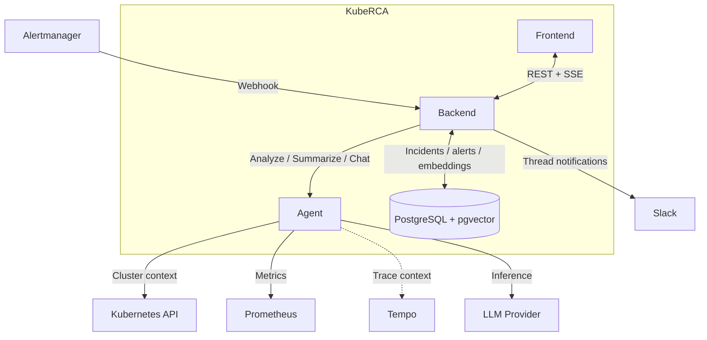

<p align="center">
  
</p>

<h1 align="center">KubeRCA</h1>

<p align="center">
  <strong>AI-powered Kubernetes incident analysis and Root Cause Analysis</strong>
</p>

<p align="center">
  <a href="LICENSE"></a>
  
  
  
  
</p>

---

## Overview

KubeRCA is an open-source tool that turns Kubernetes alerts into actionable incident context, AI-assisted analysis, and operator workflows.

It is designed for the gap between "an alert fired" and "we understand what happened." Instead of manually collecting logs, events, metrics, and past incident history, KubeRCA ingests alerts, gathers evidence, runs RCA with LLM providers, and surfaces the results in Slack and a web dashboard.

When alerts fire, KubeRCA:

1. Receives alerts from Alertmanager.
2. Creates or updates incidents and stores alert history.
3. Collects Kubernetes and observability context for RCA.
4. Publishes analysis to Slack threads and the dashboard.
5. Supports follow-up workflows such as manual resolve, similarity search, feedback, and in-app chat.

## Key Features

- **Alert-driven incident intake**: Receive alerts through Alertmanager webhook integration and map them into incidents and alerts automatically.
- **AI-powered RCA**: Run analysis with Strands Agents using `gemini`, `openai`, or `anthropic` providers.
- **Context collection**: Gather Kubernetes, Prometheus, and Tempo context around the affected workload.
- **Slack thread delivery**: Post incident updates and RCA summaries back into threaded Slack notifications.
- **Manual alert resolve**: Resolve alerts individually or in bulk when Alertmanager resolution signals are missing or delayed.
- **Similar incident search**: Store embeddings in PostgreSQL + pgvector and find related past incidents.
- **Realtime dashboard sync**: Stream updates to the UI through SSE with polling fallback.
- **Operator feedback loop**: Capture votes and comments on incident and alert analyses.
- **Context-aware AI chat**: Ask follow-up questions through the in-app chat flow backed by the Agent service.
- **Webhook settings UI**: Manage outbound webhook integrations from the application UI.
- **Google OIDC support**: Enable SSO alongside local auth flows.
- **Helm-based deployment**: Install the full stack into Kubernetes through the `kube-rca` chart.

## Architecture



For runtime flows and component responsibilities, see [Architecture Details](docs/ARCHITECTURE.md).

## Quick Start

### Prerequisites

- Kubernetes cluster
- Helm 3.x
- An API key for one supported AI provider
- Alertmanager for automatic alert ingestion

Slack, OIDC, and external PostgreSQL are optional. You can start with the bundled PostgreSQL chart and no Slack integration.
If you want browser access through Ingress, make sure an Ingress controller is installed in your cluster.

### Install with Helm

```bash
helm upgrade --install kube-rca oci://public.ecr.aws/r5b7j2e4/kube-rca-ecr/charts/kube-rca \
  --namespace kube-rca --create-namespace \
  -f values.yaml
```

Minimal `values.yaml` example:

```yaml
postgresql:
  auth:
    existingSecret: ""
    password: "change-me"

backend:
  slack:
    enabled: false
  postgresql:
    secret:
      existingSecret: ""
  embedding:
    apiKey:
      existingSecret: ""

agent:
  aiProvider: "gemini"
  gemini:
    apiKey: "YOUR_GEMINI_API_KEY"
    secret:
      existingSecret: ""

frontend:
  ingress:
    enabled: true
    hosts:
      - "kube-rca.example.com"
```

### Connect Alertmanager

```yaml
receivers:
  - name: "kube-rca"
    webhook_configs:
      - url: "http://kube-rca-backend.kube-rca.svc.cluster.local:8080/webhook/alertmanager"
        send_resolved: true

route:
  receiver: "kube-rca"
```

Need a step-by-step walkthrough? See the [Installation Guide (Korean)](docs/installation-guide-ko.md) and the full [Helm Chart README](charts/kube-rca/README.md).

## Repository Structure

```text
.
├── backend/   Go API for auth, incidents, alerts, embeddings, feedback, chat, and SSE
├── frontend/  React dashboard for incident operations and realtime views
├── agent/     FastAPI analysis service for RCA, incident summaries, and chat
├── charts/    Helm chart for deploying KubeRCA into Kubernetes
├── chaos/     Chaos Mesh scenarios and helper scripts for failure injection
└── docs/      Architecture, project background, guides, diagrams, and assets
```

## Local Development

```bash
# Backend
cd backend
go test ./...

# Agent
cd agent
make install
make test

# Frontend
cd frontend
npm ci
npm run dev

# Helm
helm lint charts/kube-rca
```

Component-level references:

- [Backend README](backend/README.md)
- [Agent README](agent/README.md)
- [Frontend README](frontend/README.md)

## Documentation

- [Architecture Details](docs/ARCHITECTURE.md)
- [Project Background](docs/PROJECT.md)
- [Installation Guide (Korean)](docs/installation-guide-ko.md)
- [Helm Chart README](charts/kube-rca/README.md)
- [Sequence Diagrams and Visuals](docs/diagrams/)

## Contributing

Issues and pull requests are welcome. If you are changing behavior across backend, agent, frontend, or Helm values, keep the documentation in `docs/` and component READMEs aligned with the implementation.

## License

This project is licensed under the MIT License. See [LICENSE](LICENSE) for details.
