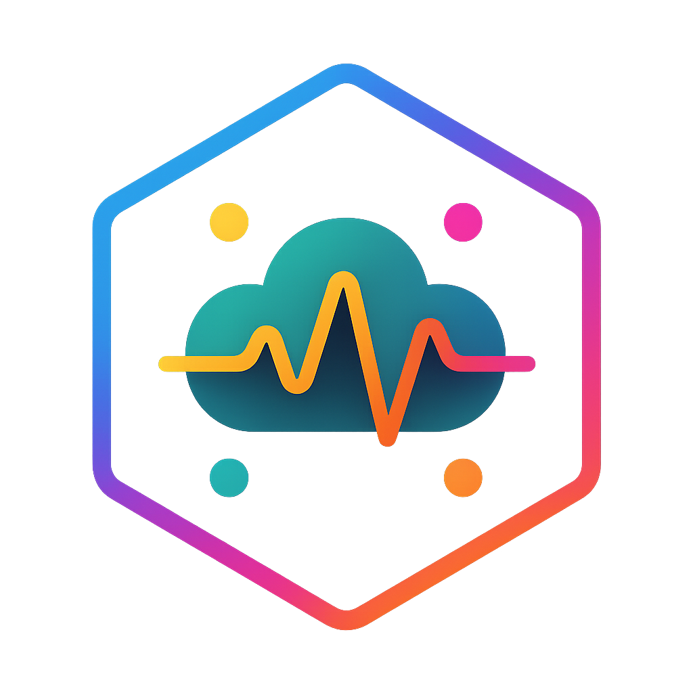
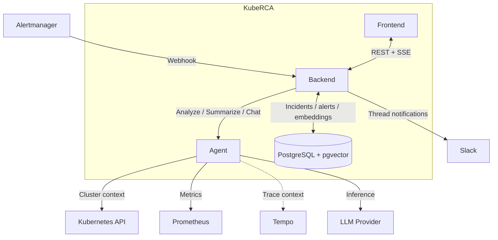

<p align="center">
  
</p>

<h1 align="center">KubeRCA</h1>

<p align="center">
  <strong>AI-powered Kubernetes incident analysis and Root Cause Analysis</strong>
</p>

<p align="center">
  <a href="LICENSE"></a>
  
  
  
  
</p>

---

## Why KubeRCA

KubeRCA is an open-source tool that turns Kubernetes alerts into actionable incident context, AI-assisted analysis, and operator workflows.

It is built for the gap between "an alert fired" and "we understand what happened." In many Kubernetes environments, operators still have to gather logs, metrics, events, traces, and past incident notes by hand before they can even start reasoning about root cause. KubeRCA shortens that loop by connecting alert intake, context collection, RCA generation, Slack thread delivery, and dashboard workflows into one system.

### The Operational Problem It Targets

- **Context collection is slow**: teams lose time jumping between Kubernetes, monitoring tools, Slack, and dashboards after every alert.
- **RCA quality varies by operator**: the initial hypothesis, evidence gathered, and explanation format often depend on who is on call.
- **Past incidents are hard to reuse**: similar failures may have already happened, but the response knowledge is rarely searchable in a structured way.

KubeRCA addresses those gaps by capturing incident data as it happens, generating explainable RCA summaries, and making related incidents, feedback, and follow-up discussion part of the same workflow.

## When To Use It

KubeRCA is a strong fit when you already operate Kubernetes with Alertmanager and want faster incident triage, more consistent RCA, and a searchable incident history.

### Best Fit

- Teams receiving production or staging alerts through Alertmanager.
- Operators who use Slack threads or a web dashboard as their incident working surface.
- Environments where similar incidents recur and historical reuse is valuable.
- Platforms that want LLM-assisted triage without replacing their current observability stack.

### Not Optimized For

- Log-only workflows without structured alerts.
- Teams looking for a generic APM replacement rather than incident-focused RCA assistance.
- Organizations that want a fully autonomous remediation engine instead of operator-in-the-loop analysis.

## How It Works



### Operator Workflow

| Stage | What happens |
| --- | --- |
| Alert intake | Alertmanager sends alerts to the Backend via `POST /webhook/alertmanager`. |
| Incident creation | Backend creates or updates incidents, stores alerts, and tracks Slack thread metadata. |
| RCA generation | Backend calls the Agent, which collects Kubernetes and observability context and runs LLM analysis. |
| Team visibility | Backend publishes results to Slack threads and streams updates to the Frontend over SSE. |
| Resolution workflows | Operators can resolve incidents, manually resolve alerts, search similar incidents, leave feedback, and use in-app chat. |
| Knowledge reuse | Incident summaries and embeddings are stored in PostgreSQL + pgvector for later search and review. |

For the full runtime sequence and API surface, see [Architecture Details](docs/ARCHITECTURE.md) and the diagrams under [docs/diagrams](docs/diagrams/).

## Key Capabilities

### Detection To RCA

- Receive alerts through Alertmanager webhook integration and map them into incidents and alerts automatically.
- Collect Kubernetes, Prometheus, and Tempo context around the affected workload.
- Run RCA with Strands Agents using `gemini`, `openai`, or `anthropic`.

### Operator Workflows

- Publish incident updates and RCA summaries into threaded Slack conversations.
- Stream incident and alert state changes to the dashboard through SSE with polling fallback.
- Support manual alert resolve, feedback comments and votes, and context-aware chat.

### Search And Knowledge Reuse

- Summarize resolved incidents and store embeddings in PostgreSQL + pgvector.
- Search for similar past incidents to reuse investigation patterns and responses.
- Keep incident, alert, feedback, and webhook routing data in one system of record.

### Deployment And Access

- Deploy the full stack with the `kube-rca` Helm chart.
- Use local auth by default or enable Google OIDC for SSO-style access.
- Run on top of your existing Kubernetes and monitoring setup without replacing it.

## 10-Minute Evaluation Path

Use this path if you want to evaluate the system quickly rather than read all documentation first.

### 1. Install The Stack

```bash
helm upgrade --install kube-rca oci://public.ecr.aws/r5b7j2e4/kube-rca-ecr/charts/kube-rca \
  --namespace kube-rca --create-namespace \
  -f values.yaml
```

Minimal `values.yaml` example:

```yaml
postgresql:
  auth:
    existingSecret: ""
    password: "change-me"

backend:
  slack:
    enabled: false
  postgresql:
    secret:
      existingSecret: ""
  embedding:
    apiKey:
      existingSecret: ""

agent:
  aiProvider: "gemini"
  gemini:
    apiKey: "YOUR_GEMINI_API_KEY"
    secret:
      existingSecret: ""

frontend:
  ingress:
    enabled: true
    hosts:
      - "kube-rca.example.com"
```

### 2. Connect Alertmanager

```yaml
receivers:
  - name: "kube-rca"
    webhook_configs:
      - url: "http://kube-rca-backend.kube-rca.svc.cluster.local:8080/webhook/alertmanager"
        send_resolved: true

route:
  receiver: "kube-rca"
```

### 3. Confirm The First Incident Flow

- Trigger or forward a real alert from your cluster.
- Verify that the Backend stores the alert, the Agent returns analysis, and the dashboard updates in realtime.
- If Slack is enabled, confirm that the incident and RCA are posted in the same thread.

### 4. Evaluate Follow-Up Workflows

- Resolve an incident and verify incident summarization and similarity search.
- Try manual alert resolve for a case where Alertmanager resolution may be delayed.
- Open the chat panel or feedback flow to see how operators can refine or discuss the analysis.

Need step-by-step setup? See the full [Helm Chart README](charts/kube-rca/README.md) and the [Installation Guide (Korean)](docs/installation-guide-ko.md), which also includes a first scenario walkthrough.

## Integrations And Deployment Model

| Area | Default / Supported | Notes |
| --- | --- | --- |
| Alert source | Alertmanager | Primary ingestion path for incidents and alerts |
| Notification | Slack | Optional but strongly aligned with threaded incident workflows |
| AI providers | Gemini, OpenAI, Anthropic | Selected through `agent.aiProvider` |
| Cluster context | Kubernetes API | Core runtime evidence source |
| Observability enrichers | Prometheus, Tempo | Additional signal sources when configured |
| Database | PostgreSQL + pgvector | Incident, feedback, and embedding storage |
| Auth | Local auth, Google OIDC | OIDC is optional |
| Deployment | Helm, ArgoCD-oriented usage | The chart is the main deployment entrypoint |

## Documentation And Repo Map

### Start Here

- [Architecture Details](docs/ARCHITECTURE.md)
- [Project Background](docs/PROJECT.md)
- [Installation Guide (Korean)](docs/installation-guide-ko.md)
- [Helm Chart README](charts/kube-rca/README.md)

### Component References

- [Backend README](backend/README.md)
- [Agent README](agent/README.md)
- [Frontend README](frontend/README.md)

### Diagrams

- [System Context](docs/diagrams/system_context_diagram.md)
- [Alert Analysis Sequence](docs/diagrams/alert_analysis_sequence_diagram.md)
- [Incident Analysis Sequence](docs/diagrams/incident_analysis_sequence_diagram.md)
- [Login Sequence](docs/diagrams/login_sequence_diagram.md)

### Repo Map

```text
.
├── backend/   Go API for auth, incidents, alerts, embeddings, feedback, chat, and SSE
├── frontend/  React dashboard for incident operations and realtime views
├── agent/     FastAPI analysis service for RCA, incident summaries, and chat
├── charts/    Helm chart for deploying KubeRCA into Kubernetes
├── chaos/     Chaos Mesh scenarios and helper scripts for failure injection
└── docs/      Architecture, guides, diagrams, and assets
```

### Local Development

```bash
# Backend
cd backend
go test ./...

# Agent
cd agent
make install
make test

# Frontend
cd frontend
npm ci
npm run dev

# Helm
helm lint charts/kube-rca
```

## FAQ

### Do I Need Slack?

No. Slack is optional. You can start with the dashboard-only flow and enable Slack later if threaded notifications fit your incident process.

### Do I Need Tempo Or Other Advanced Observability Backends?

No. KubeRCA can start with Kubernetes alerts and the core cluster context path. Additional observability backends improve analysis depth when they are available.

### Can I Use External PostgreSQL?

Yes. The chart supports PostgreSQL configuration beyond the bundled dependency. See the chart README for the installation-specific values.

### Which AI Provider Should I Start With?

The project examples use Gemini for the quickest path, but OpenAI and Anthropic are also supported through the same provider abstraction.

### Can I Run Without OIDC?

Yes. Local auth works without OIDC. Google OIDC is optional and can be enabled later when you want centralized login.

## Contributing

Issues and pull requests are welcome. If you change behavior across backend, agent, frontend, or Helm values, keep the documentation in `docs/` and component READMEs aligned with the implementation.

## License

This project is licensed under the MIT License. See [LICENSE](LICENSE) for details.
