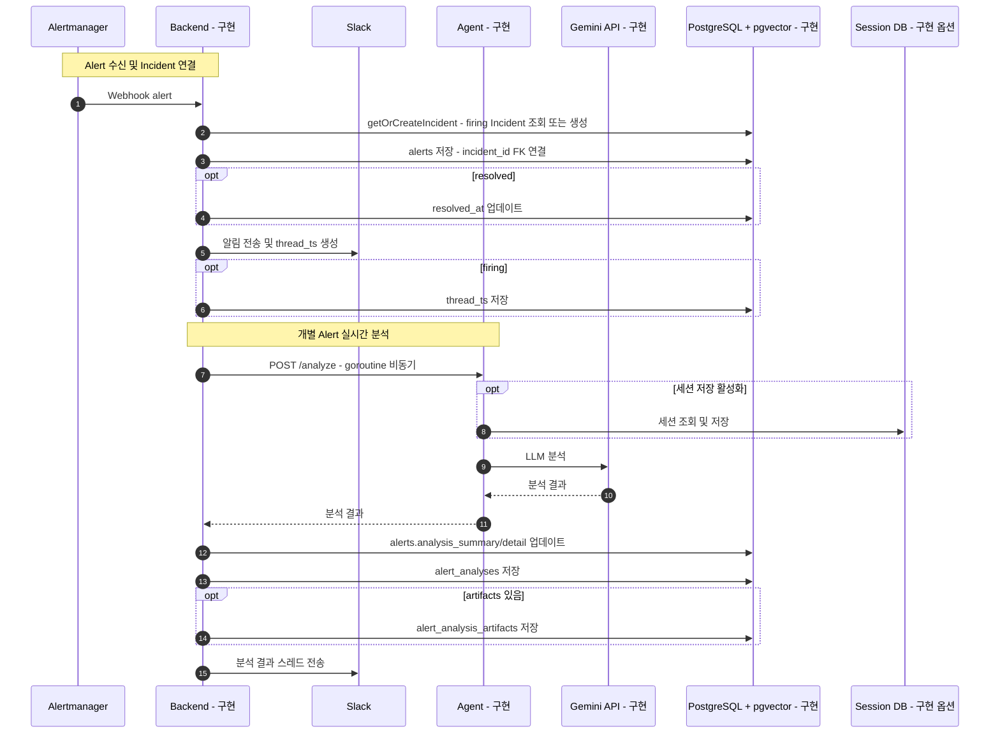

```mermaid
sequenceDiagram
  autonumber
  participant AM as Alertmanager
  participant BE as Backend - 구현
  participant SL as Slack
  participant AG as Agent - 구현
  participant LLM as Gemini API - 구현
  participant DB as PostgreSQL + pgvector - 구현
  participant SDB as Session DB - 구현 옵션

  Note over AM,BE: Alert 수신 및 Incident 연결
  AM->>BE: Webhook alert
  BE->>DB: getOrCreateIncident - firing Incident 조회 또는 생성
  BE->>DB: alerts 저장 - incident_id FK 연결
  opt resolved
    BE->>DB: resolved_at 업데이트
  end
  BE->>SL: 알림 전송 및 thread_ts 생성
  opt firing
    BE->>DB: thread_ts 저장
  end

  Note over BE,AG: 개별 Alert 실시간 분석
  BE->>AG: POST /analyze - goroutine 비동기
  opt 세션 저장 활성화
    AG->>SDB: 세션 조회 및 저장
  end
  AG->>LLM: LLM 분석
  LLM-->>AG: 분석 결과
  AG-->>BE: 분석 결과
  BE->>DB: alerts.analysis_summary/detail 업데이트
  BE->>DB: alert_analyses 저장
  opt artifacts 있음
    BE->>DB: alert_analysis_artifacts 저장
  end
  BE->>SL: 분석 결과 스레드 전송
```
