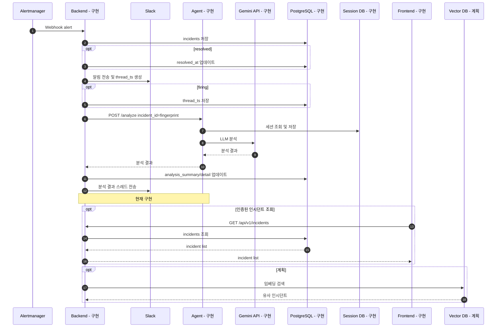

```mermaid
sequenceDiagram
  autonumber
  participant AM as Alertmanager
  participant BE as Backend - 구현
  participant SL as Slack
  participant AG as Agent - 구현
  participant LLM as Gemini API - 구현
  participant DB as PostgreSQL - 구현
  participant SDB as Session DB - 구현
  participant FE as Frontend - 구현
  participant VDB as Vector DB - 계획

  AM->>BE: Webhook alert
  BE->>DB: incidents 저장
  opt resolved
    BE->>DB: resolved_at 업데이트
  end
  BE->>SL: 알림 전송 및 thread_ts 생성
  opt firing
    BE->>DB: thread_ts 저장
  end
  BE->>AG: POST /analyze incident_id=fingerprint
  AG->>SDB: 세션 조회 및 저장
  AG->>LLM: LLM 분석
  LLM-->>AG: 분석 결과
  AG-->>BE: 분석 결과
  BE->>DB: analysis_summary/detail 업데이트
  BE->>SL: 분석 결과 스레드 전송
  Note over BE,AG: 현재 구현

  opt 인증된 인시던트 조회
    FE->>BE: GET /api/v1/incidents
    BE->>DB: incidents 조회
    DB-->>BE: incident list
    BE-->>FE: incident list
  end

  opt 계획
    BE->>VDB: 임베딩 검색
    VDB-->>BE: 유사 인시던트
  end
```
