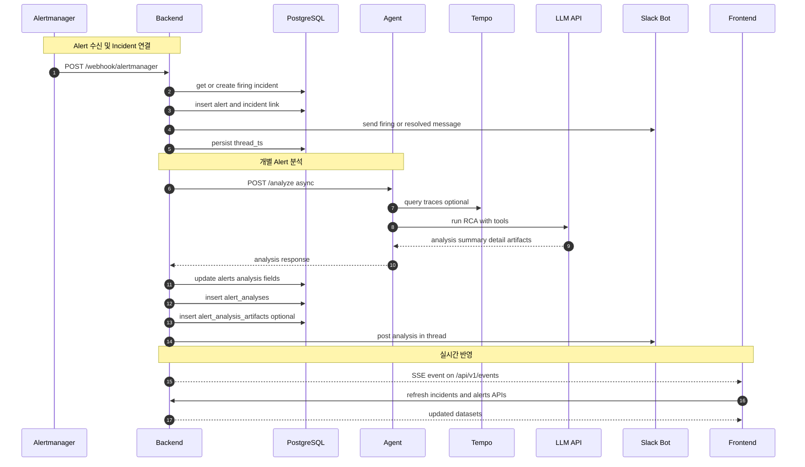

```mermaid
sequenceDiagram
  autonumber
  participant AM as Alertmanager
  participant BE as Backend
  participant DB as PostgreSQL
  participant AG as Agent
  participant TP as Tempo
  participant LLM as LLM API
  participant SL as Slack Bot
  participant FE as Frontend

  Note over AM,BE: Alert 수신 및 Incident 연결
  AM->>BE: POST /webhook/alertmanager
  BE->>DB: get or create firing incident
  BE->>DB: insert alert and incident link
  BE->>SL: send firing or resolved message
  BE->>DB: persist thread_ts

  Note over BE,AG: 개별 Alert 분석
  BE->>AG: POST /analyze async
  AG->>TP: query traces optional
  AG->>LLM: run RCA with tools
  LLM-->>AG: analysis summary detail artifacts
  AG-->>BE: analysis response

  BE->>DB: update alerts analysis fields
  BE->>DB: insert alert_analyses
  BE->>DB: insert alert_analysis_artifacts optional
  BE->>SL: post analysis in thread

  Note over BE,FE: 실시간 반영
  BE-->>FE: SSE event on /api/v1/events
  FE->>BE: refresh incidents and alerts APIs
  BE-->>FE: updated datasets
```
