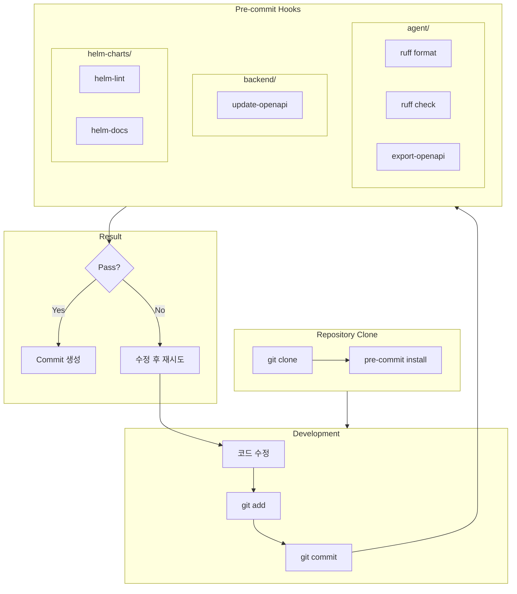

```mermaid
flowchart TD
  subgraph Clone["Repository Clone"]
    C1[git clone]
    C2[pre-commit install]
    C1 --> C2
  end

  subgraph Dev["Development"]
    D1[코드 수정]
    D2[git add]
    D3[git commit]
    D1 --> D2 --> D3
  end

  subgraph PreCommit["Pre-commit Hooks"]
    direction TB
    subgraph Agent["agent/"]
      A1[ruff format]
      A2[ruff check]
      A3[export-openapi]
    end
    subgraph Backend["backend/"]
      B1[update-openapi]
    end
    subgraph Helm["helm-charts/"]
      H1[helm-lint]
      H2[helm-docs]
    end
  end

  subgraph Result["Result"]
    R1{Pass?}
    R2[Commit 생성]
    R3[수정 후 재시도]
  end

  Clone --> Dev
  D3 --> PreCommit
  PreCommit --> R1
  R1 -->|Yes| R2
  R1 -->|No| R3
  R3 --> D1
```
