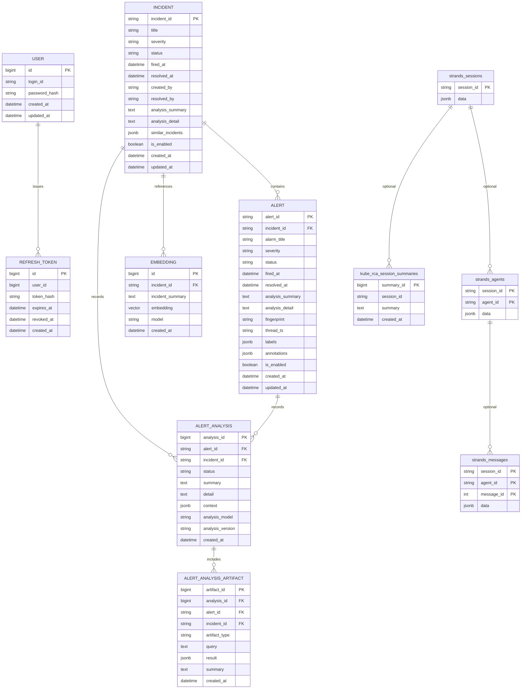

```mermaid
erDiagram
  %% strands_* and kube_rca_session_summaries are used when session DB is enabled.
  USER ||--o{ REFRESH_TOKEN : issues
  INCIDENT ||--o{ ALERT : contains
  INCIDENT ||--o{ EMBEDDING : references
  INCIDENT ||--o{ ALERT_ANALYSIS : records
  ALERT ||--o{ ALERT_ANALYSIS : records
  ALERT_ANALYSIS ||--o{ ALERT_ANALYSIS_ARTIFACT : includes
  strands_sessions ||--o{ strands_agents : optional
  strands_agents ||--o{ strands_messages : optional
  strands_sessions ||--o{ kube_rca_session_summaries : optional

  USER {
    bigint id PK
    string login_id
    string password_hash
    datetime created_at
    datetime updated_at
  }

  REFRESH_TOKEN {
    bigint id PK
    bigint user_id
    string token_hash
    datetime expires_at
    datetime revoked_at
    datetime created_at
  }

  INCIDENT {
    string incident_id PK
    string title
    string severity
    string status
    datetime fired_at
    datetime resolved_at
    string created_by
    string resolved_by
    text analysis_summary
    text analysis_detail
    jsonb similar_incidents
    boolean is_enabled
    datetime created_at
    datetime updated_at
  }

  ALERT {
    string alert_id PK
    string incident_id FK
    string alarm_title
    string severity
    string status
    datetime fired_at
    datetime resolved_at
    text analysis_summary
    text analysis_detail
    string fingerprint
    string thread_ts
    jsonb labels
    jsonb annotations
    boolean is_enabled
    datetime created_at
    datetime updated_at
  }

  ALERT_ANALYSIS {
    bigint analysis_id PK
    string alert_id FK
    string incident_id FK
    string status
    text summary
    text detail
    jsonb context
    string analysis_model
    string analysis_version
    datetime created_at
  }

  ALERT_ANALYSIS_ARTIFACT {
    bigint artifact_id PK
    bigint analysis_id FK
    string alert_id FK
    string incident_id FK
    string artifact_type
    text query
    jsonb result
    text summary
    datetime created_at
  }

  EMBEDDING {
    bigint id PK
    string incident_id FK
    text incident_summary
    vector embedding
    string model
    datetime created_at
  }

  strands_sessions {
    string session_id PK
    jsonb data
  }

  strands_agents {
    string session_id PK
    string agent_id PK
    jsonb data
  }

  strands_messages {
    string session_id PK
    string agent_id PK
    int message_id PK
    jsonb data
  }

  kube_rca_session_summaries {
    bigint summary_id PK
    string session_id
    text summary
    datetime created_at
  }

```
