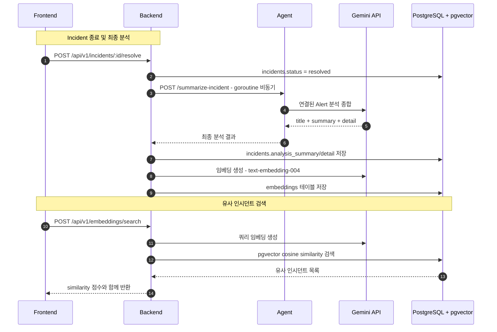

```mermaid
sequenceDiagram
  autonumber
  participant FE as Frontend
  participant BE as Backend
  participant AG as Agent
  participant LLM as Gemini API
  participant DB as PostgreSQL + pgvector

  Note over FE,BE: Incident 종료 및 최종 분석
  FE->>BE: POST /api/v1/incidents/:id/resolve
  BE->>DB: incidents.status = resolved
  BE->>AG: POST /summarize-incident - goroutine 비동기
  AG->>LLM: 연결된 Alert 분석 종합
  LLM-->>AG: title + summary + detail
  AG-->>BE: 최종 분석 결과
  BE->>DB: incidents.analysis_summary/detail 저장
  BE->>LLM: 임베딩 생성 - text-embedding-004
  BE->>DB: embeddings 테이블 저장

  Note over FE,DB: 유사 인시던트 검색
  FE->>BE: POST /api/v1/embeddings/search
  BE->>LLM: 쿼리 임베딩 생성
  BE->>DB: pgvector cosine similarity 검색
  DB-->>BE: 유사 인시던트 목록
  BE-->>FE: similarity 점수와 함께 반환
```
