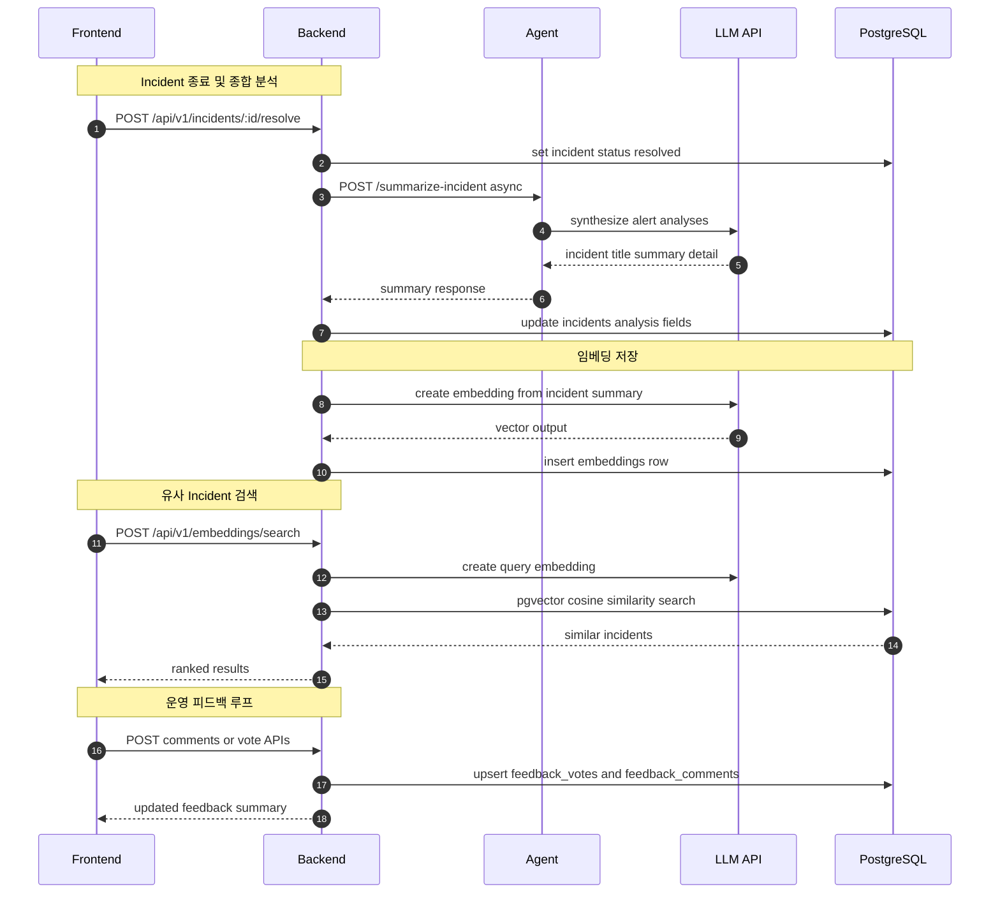

```mermaid
sequenceDiagram
  autonumber
  participant FE as Frontend
  participant BE as Backend
  participant AG as Agent
  participant LLM as LLM API
  participant DB as PostgreSQL

  Note over FE,BE: Incident 종료 및 종합 분석
  FE->>BE: POST /api/v1/incidents/:id/resolve
  BE->>DB: set incident status resolved
  BE->>AG: POST /summarize-incident async
  AG->>LLM: synthesize alert analyses
  LLM-->>AG: incident title summary detail
  AG-->>BE: summary response
  BE->>DB: update incidents analysis fields

  Note over BE,DB: 임베딩 저장
  BE->>LLM: create embedding from incident summary
  LLM-->>BE: vector output
  BE->>DB: insert embeddings row

  Note over FE,BE: 유사 Incident 검색
  FE->>BE: POST /api/v1/embeddings/search
  BE->>LLM: create query embedding
  BE->>DB: pgvector cosine similarity search
  DB-->>BE: similar incidents
  BE-->>FE: ranked results

  Note over FE,BE: 운영 피드백 루프
  FE->>BE: POST comments or vote APIs
  BE->>DB: upsert feedback_votes and feedback_comments
  BE-->>FE: updated feedback summary
```
