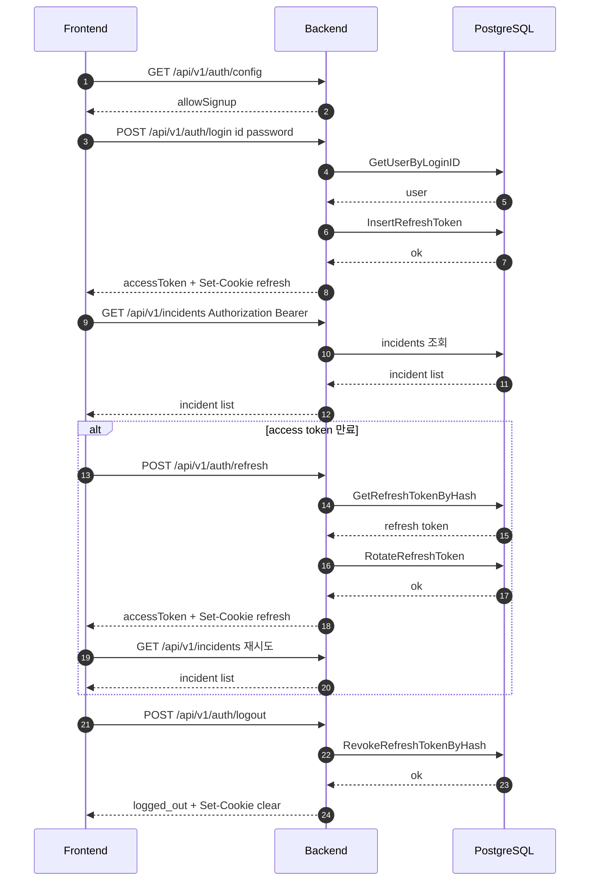

```mermaid
sequenceDiagram
  autonumber
  participant FE as Frontend
  participant BE as Backend
  participant DB as PostgreSQL

  FE->>BE: GET /api/v1/auth/config
  BE-->>FE: allowSignup

  FE->>BE: POST /api/v1/auth/login id password
  BE->>DB: GetUserByLoginID
  DB-->>BE: user
  BE->>DB: InsertRefreshToken
  DB-->>BE: ok
  BE-->>FE: accessToken + Set-Cookie refresh

  FE->>BE: GET /api/v1/incidents Authorization Bearer
  BE->>DB: incidents 조회
  DB-->>BE: incident list
  BE-->>FE: incident list

  alt access token 만료
    FE->>BE: POST /api/v1/auth/refresh
    BE->>DB: GetRefreshTokenByHash
    DB-->>BE: refresh token
    BE->>DB: RotateRefreshToken
    DB-->>BE: ok
    BE-->>FE: accessToken + Set-Cookie refresh
    FE->>BE: GET /api/v1/incidents 재시도
    BE-->>FE: incident list
  end

  FE->>BE: POST /api/v1/auth/logout
  BE->>DB: RevokeRefreshTokenByHash
  DB-->>BE: ok
  BE-->>FE: logged_out + Set-Cookie clear
```
