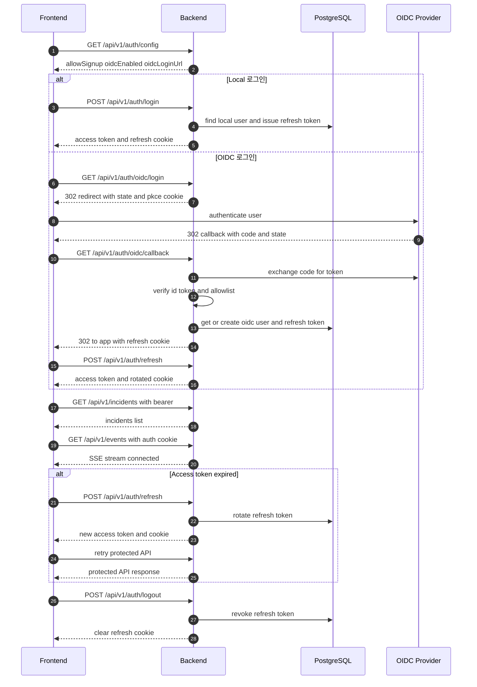

```mermaid
sequenceDiagram
  autonumber
  participant FE as Frontend
  participant BE as Backend
  participant DB as PostgreSQL
  participant OIDC as OIDC Provider

  FE->>BE: GET /api/v1/auth/config
  BE-->>FE: allowSignup oidcEnabled oidcLoginUrl

  alt Local 로그인
    FE->>BE: POST /api/v1/auth/login
    BE->>DB: find local user and issue refresh token
    BE-->>FE: access token and refresh cookie
  else OIDC 로그인
    FE->>BE: GET /api/v1/auth/oidc/login
    BE-->>FE: 302 redirect with state and pkce cookie
    FE->>OIDC: authenticate user
    OIDC-->>FE: 302 callback with code and state
    FE->>BE: GET /api/v1/auth/oidc/callback
    BE->>OIDC: exchange code for token
    BE->>BE: verify id token and allowlist
    BE->>DB: get or create oidc user and refresh token
    BE-->>FE: 302 to app with refresh cookie
    FE->>BE: POST /api/v1/auth/refresh
    BE-->>FE: access token and rotated cookie
  end

  FE->>BE: GET /api/v1/incidents with bearer
  BE-->>FE: incidents list
  FE->>BE: GET /api/v1/events with auth cookie
  BE-->>FE: SSE stream connected

  alt Access token expired
    FE->>BE: POST /api/v1/auth/refresh
    BE->>DB: rotate refresh token
    BE-->>FE: new access token and cookie
    FE->>BE: retry protected API
    BE-->>FE: protected API response
  end

  FE->>BE: POST /api/v1/auth/logout
  BE->>DB: revoke refresh token
  BE-->>FE: clear refresh cookie
```
