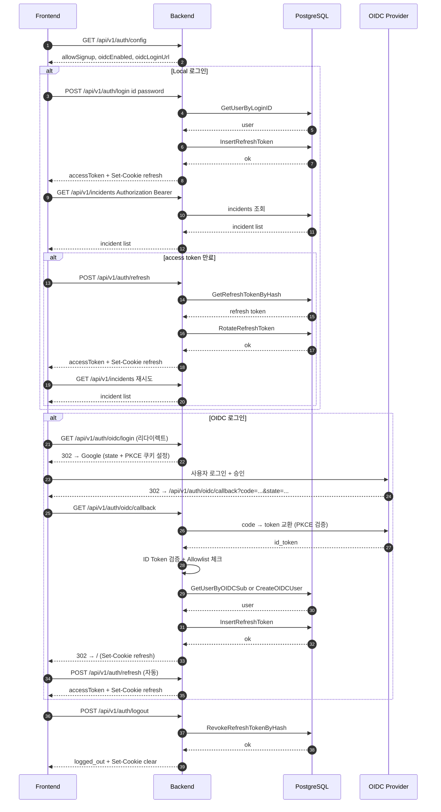

```mermaid
sequenceDiagram
  autonumber
  participant FE as Frontend
  participant BE as Backend
  participant DB as PostgreSQL
  participant Google as OIDC Provider

  FE->>BE: GET /api/v1/auth/config
  BE-->>FE: allowSignup, oidcEnabled, oidcLoginUrl

  alt Local 로그인
  FE->>BE: POST /api/v1/auth/login id password
  BE->>DB: GetUserByLoginID
  DB-->>BE: user
  BE->>DB: InsertRefreshToken
  DB-->>BE: ok
  BE-->>FE: accessToken + Set-Cookie refresh

  FE->>BE: GET /api/v1/incidents Authorization Bearer
  BE->>DB: incidents 조회
  DB-->>BE: incident list
  BE-->>FE: incident list

  alt access token 만료
    FE->>BE: POST /api/v1/auth/refresh
    BE->>DB: GetRefreshTokenByHash
    DB-->>BE: refresh token
    BE->>DB: RotateRefreshToken
    DB-->>BE: ok
    BE-->>FE: accessToken + Set-Cookie refresh
    FE->>BE: GET /api/v1/incidents 재시도
    BE-->>FE: incident list
  end

  end

  alt OIDC 로그인
    FE->>BE: GET /api/v1/auth/oidc/login (리다이렉트)
    BE-->>FE: 302 → Google (state + PKCE 쿠키 설정)
    FE->>Google: 사용자 로그인 + 승인
    Google-->>FE: 302 → /api/v1/auth/oidc/callback?code=...&state=...
    FE->>BE: GET /api/v1/auth/oidc/callback
    BE->>Google: code → token 교환 (PKCE 검증)
    Google-->>BE: id_token
    BE->>BE: ID Token 검증 + Allowlist 체크
    BE->>DB: GetUserByOIDCSub or CreateOIDCUser
    DB-->>BE: user
    BE->>DB: InsertRefreshToken
    DB-->>BE: ok
    BE-->>FE: 302 → / (Set-Cookie refresh)
    FE->>BE: POST /api/v1/auth/refresh (자동)
    BE-->>FE: accessToken + Set-Cookie refresh
  end

  FE->>BE: POST /api/v1/auth/logout
  BE->>DB: RevokeRefreshTokenByHash
  DB-->>BE: ok
  BE-->>FE: logged_out + Set-Cookie clear
```
