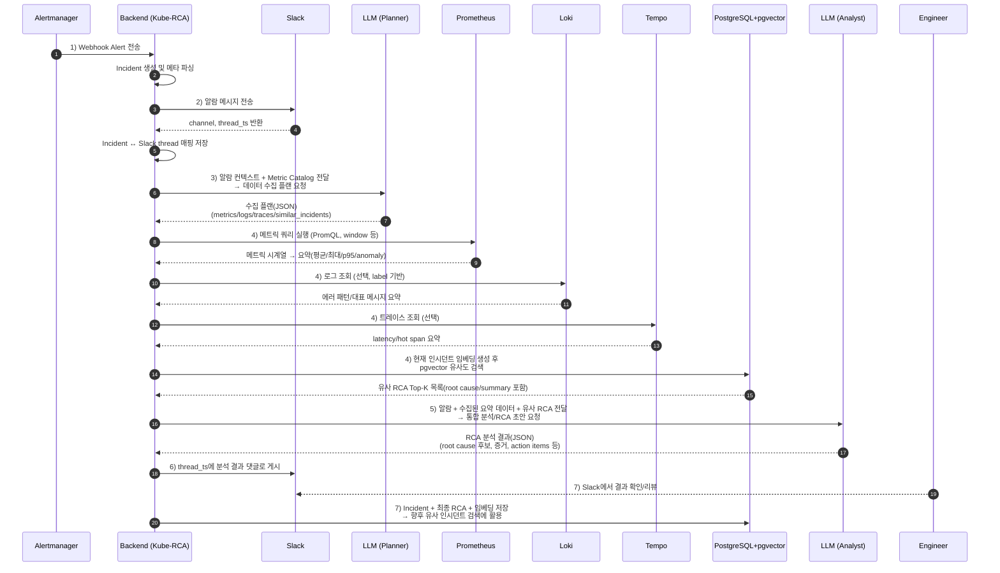

```mermaid
sequenceDiagram
    autonumber

    participant AM   as Alertmanager
    participant BE   as Backend (Kube-RCA)
    participant SL   as Slack
    participant LLMp as LLM (Planner)
    participant PR   as Prometheus
    participant LK   as Loki
    participant TP   as Tempo
    participant DB   as PostgreSQL+pgvector
    participant LLMa as LLM (Analyst)
    participant ENG  as Engineer

    AM   ->> BE: 1) Webhook Alert 전송
    BE   ->> BE: Incident 생성 및 메타 파싱

    BE   ->> SL: 2) 알람 메시지 전송
    SL  -->> BE: channel, thread_ts 반환
    BE   ->> BE: Incident ↔ Slack thread 매핑 저장

    BE   ->> LLMp: 3) 알람 컨텍스트 + Metric Catalog 전달<br/>→ 데이터 수집 플랜 요청
    LLMp -->> BE: 수집 플랜(JSON)<br/>(metrics/logs/traces/similar_incidents)

    BE   ->> PR: 4) 메트릭 쿼리 실행 (PromQL, window 등)
    PR  -->> BE: 메트릭 시계열 → 요약(평균/최대/p95/anomaly)

    BE   ->> LK: 4) 로그 조회 (선택, label 기반)
    LK  -->> BE: 에러 패턴/대표 메시지 요약

    BE   ->> TP: 4) 트레이스 조회 (선택)
    TP  -->> BE: latency/hot span 요약

    BE   ->> DB: 4) 현재 인시던트 임베딩 생성 후<br/>pgvector 유사도 검색
    DB  -->> BE: 유사 RCA Top-K 목록(root cause/summary 포함)

    BE   ->> LLMa: 5) 알람 + 수집된 요약 데이터 + 유사 RCA 전달<br/>→ 통합 분석/RCA 초안 요청
    LLMa -->> BE: RCA 분석 결과(JSON)<br/>(root cause 후보, 증거, action items 등)

    BE   ->> SL: 6) thread_ts에 분석 결과 댓글로 게시
    ENG -->> SL: 7) Slack에서 결과 확인/리뷰

    BE   ->> DB: 7) Incident + 최종 RCA + 임베딩 저장<br/>→ 향후 유사 인시던트 검색에 활용
```
