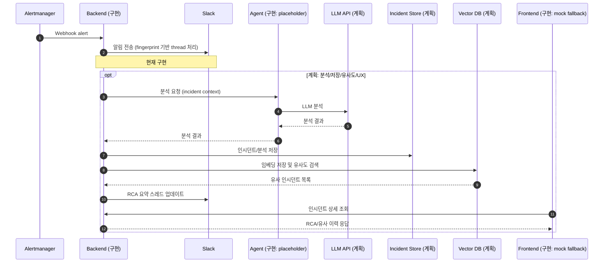

```mermaid
sequenceDiagram
  autonumber
  participant AM as Alertmanager
  participant BE as Backend (구현)
  participant SL as Slack
  participant AG as Agent (구현: placeholder)
  participant LLM as LLM API (계획)
  participant DB as Incident Store (계획)
  participant VDB as Vector DB (계획)
  participant FE as Frontend (구현: mock fallback)

  AM->>BE: Webhook alert
  BE->>SL: 알림 전송 (fingerprint 기반 thread 처리)
  Note over BE,SL: 현재 구현

  opt 계획: 분석/저장/유사도/UX
    BE->>AG: 분석 요청 (incident context)
    AG->>LLM: LLM 분석
    LLM-->>AG: 분석 결과
    AG-->>BE: 분석 결과
    BE->>DB: 인시던트/분석 저장
    BE->>VDB: 임베딩 저장 및 유사도 검색
    VDB-->>BE: 유사 인시던트 목록
    BE->>SL: RCA 요약 스레드 업데이트
    FE->>BE: 인시던트 상세 조회
    BE-->>FE: RCA/유사 이력 응답
  end
```
