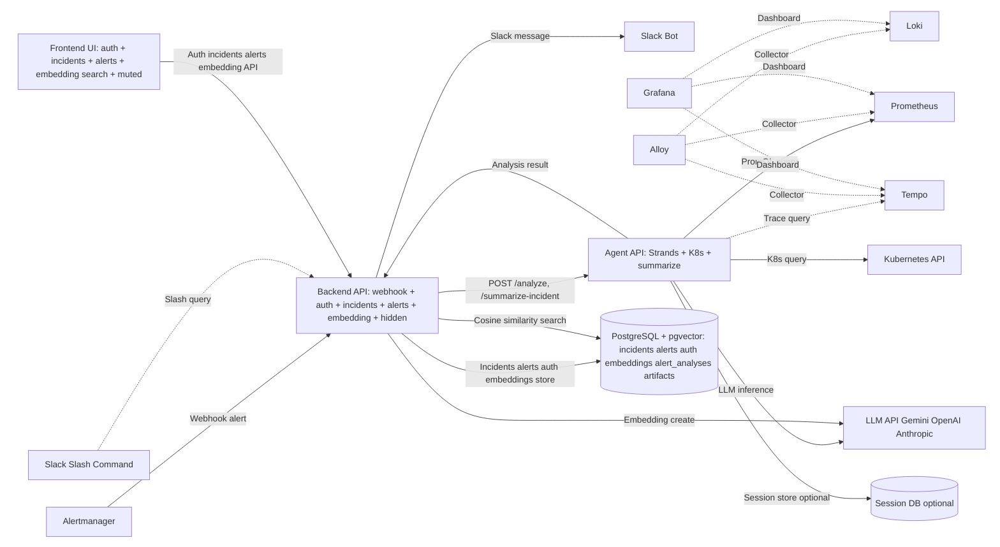

```mermaid
flowchart LR
  %% External
  AM[Alertmanager]
  SL[Slack Bot]
  SC[Slack Slash Command]
  LLM[LLM API Gemini OpenAI Anthropic]
  PR[Prometheus]
  K8S[Kubernetes API]
  GK[Grafana]
  LO[Loki]
  TP[Tempo]
  AL[Alloy]

  %% Internal
  subgraph Core[" "]
    direction TB
    FE[Frontend UI: auth + incidents + alerts + embedding search + muted]
    BE[Backend API: webhook + auth + incidents + alerts + embedding + hidden]
  end
  style Core fill:transparent,stroke:transparent

  AG[Agent API: Strands + K8s + summarize]
  PG[(PostgreSQL + pgvector: incidents alerts auth embeddings alert_analyses artifacts)]
  SDB[(Session DB optional)]

  AM -->|Webhook alert| BE
  BE -->|Slack message| SL
  SC -.->|Slash query| BE

  FE -->|Auth incidents alerts embedding API| BE
  BE -->|POST /analyze, /summarize-incident| AG
  AG -->|Analysis result| BE

  AG -->|K8s query| K8S
  AG -->|PromQL query| PR
  AG -.->|Trace query| TP
  AG -->|LLM inference| LLM
  BE -->|Embedding create| LLM

  BE -->|Incidents alerts auth embeddings store| PG
  BE -->|Cosine similarity search| PG
  AG -->|Session store optional| SDB

  AL -.->|Collector| PR
  AL -.->|Collector| LO
  AL -.->|Collector| TP
  GK -.->|Dashboard| PR
  GK -.->|Dashboard| LO
  GK -.->|Dashboard| TP
```
