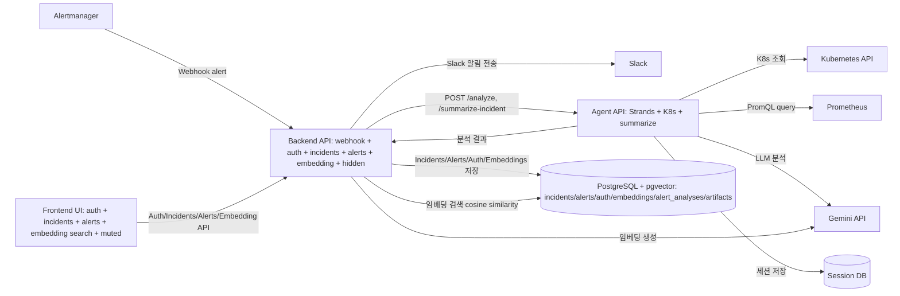

```mermaid
flowchart LR
  %% External
  AM[Alertmanager]
  SL[Slack]
  LLM[Gemini API]
  PR[Prometheus]
  K8S[Kubernetes API]

  %% Internal
  subgraph Core[" "]
    direction TB
    FE[Frontend UI: auth + incidents + alerts + embedding search + muted]
    BE[Backend API: webhook + auth + incidents + alerts + embedding + hidden]
  end
  style Core fill:transparent,stroke:transparent

  AG[Agent API: Strands + K8s + summarize]
  PG[(PostgreSQL + pgvector: incidents/alerts/auth/embeddings/alert_analyses/artifacts)]
  SDB[(Session DB)]

  AM -->|Webhook alert| BE
  BE -->|Slack 알림 전송| SL

  FE -->|Auth/Incidents/Alerts/Embedding API| BE
  BE -->|POST /analyze, /summarize-incident| AG
  AG -->|분석 결과| BE

  AG -->|K8s 조회| K8S
  AG -->|PromQL query| PR
  AG -->|LLM 분석| LLM
  BE -->|임베딩 생성| LLM

  BE -->|Incidents/Alerts/Auth/Embeddings 저장| PG
  BE -->|임베딩 검색 cosine similarity| PG
  AG -->|세션 저장| SDB
```
