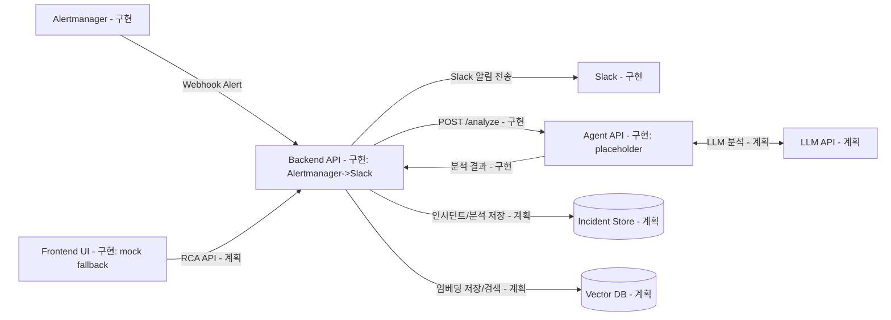

```mermaid
flowchart LR
  %% External
  AM[Alertmanager - 구현]
  SL[Slack - 구현]
  LLM[LLM API - 계획]

  %% Internal
  subgraph Core[" "]
    direction TB
    FE[Frontend UI - 구현: mock fallback]
    BE[Backend API - 구현: Alertmanager->Slack]
  end
  style Core fill:transparent,stroke:transparent

  AG[Agent API - 구현: placeholder]
  DB[(Incident Store - 계획)]
  VDB[(Vector DB - 계획)]

  AM -->|Webhook Alert| BE
  BE -->|Slack 알림 전송| SL

  BE -->|POST /analyze - 구현| AG
  AG -->|분석 결과 - 구현| BE
  AG <--> |LLM 분석 - 계획| LLM

  BE -->|인시던트/분석 저장 - 계획| DB
  BE -->|임베딩 저장/검색 - 계획| VDB

  FE -->|RCA API - 계획| BE
```
