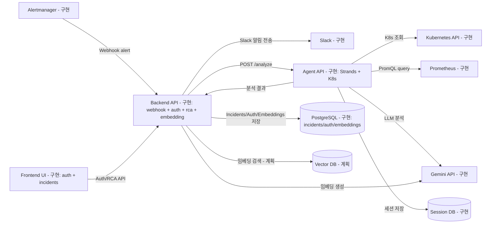

```mermaid
flowchart LR
  %% External
  AM[Alertmanager - 구현]
  SL[Slack - 구현]
  LLM[Gemini API - 구현]
  PR[Prometheus - 구현]
  K8S[Kubernetes API - 구현]

  %% Internal
  subgraph Core[" "]
    direction TB
    FE[Frontend UI - 구현: auth + incidents]
    BE[Backend API - 구현: webhook + auth + rca + embedding]
  end
  style Core fill:transparent,stroke:transparent

  AG[Agent API - 구현: Strands + K8s]
  PG[(PostgreSQL - 구현: incidents/auth/embeddings)]
  SDB[(Session DB - 구현)]
  VDB[(Vector DB - 계획)]

  AM -->|Webhook alert| BE
  BE -->|Slack 알림 전송| SL

  FE -->|Auth/RCA API| BE
  BE -->|POST /analyze| AG
  AG -->|분석 결과| BE

  AG -->|K8s 조회| K8S
  AG -->|PromQL query| PR
  AG -->|LLM 분석| LLM
  BE -->|임베딩 생성| LLM

  BE -->|Incidents/Auth/Embeddings 저장| PG
  AG -->|세션 저장| SDB
  BE -->|임베딩 검색 - 계획| VDB
```
