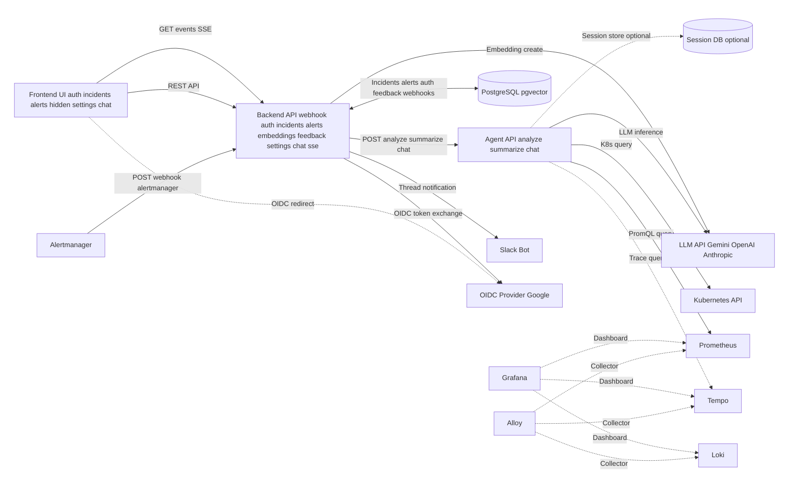

```mermaid
flowchart LR
  %% External
  AM[Alertmanager]
  SL[Slack Bot]
  OIDC[OIDC Provider Google]
  LLM[LLM API Gemini OpenAI Anthropic]
  K8S[Kubernetes API]
  PR[Prometheus]
  TP[Tempo]
  LO[Loki]
  GK[Grafana]
  AL[Alloy]

  %% Internal
  subgraph Core[ ]
    direction TB
    FE[Frontend UI auth incidents alerts hidden settings chat]
    BE[Backend API webhook auth incidents alerts embeddings feedback settings chat sse]
    AG[Agent API analyze summarize chat]
    PG[(PostgreSQL pgvector)]
    SDB[(Session DB optional)]
  end
  style Core fill:transparent,stroke:transparent

  AM -->|POST webhook alertmanager| BE
  FE -->|REST API| BE
  FE -->|GET events SSE| BE
  FE -.->|OIDC redirect| OIDC
  BE -->|OIDC token exchange| OIDC

  BE -->|Thread notification| SL
  BE -->|POST analyze summarize chat| AG
  AG -->|K8s query| K8S
  AG -->|PromQL query| PR
  AG -.->|Trace query| TP
  AG -->|LLM inference| LLM

  BE -->|Embedding create| LLM
  BE <-->|Incidents alerts auth feedback webhooks| PG
  AG -.->|Session store optional| SDB

  AL -.->|Collector| PR
  AL -.->|Collector| LO
  AL -.->|Collector| TP
  GK -.->|Dashboard| PR
  GK -.->|Dashboard| LO
  GK -.->|Dashboard| TP
```
