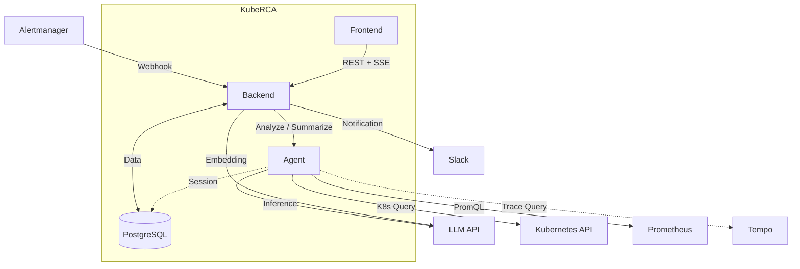

```mermaid
flowchart TD
  AM[Alertmanager]
  SL[Slack]
  LLM[LLM API]
  K8S[Kubernetes API]
  PR[Prometheus]
  TP[Tempo]

  subgraph KubeRCA
    FE[Frontend]
    BE[Backend]
    AG[Agent]
    PG[(PostgreSQL)]
  end

  AM -->|Webhook| BE
  BE -->|Notification| SL
  FE -->|REST + SSE| BE
  BE -->|Analyze / Summarize| AG
  AG -->|K8s Query| K8S
  AG -->|PromQL| PR
  AG -.->|Trace Query| TP
  AG -->|Inference| LLM
  BE -->|Embedding| LLM
  BE <-->|Data| PG
  AG -.->|Session| PG
```
